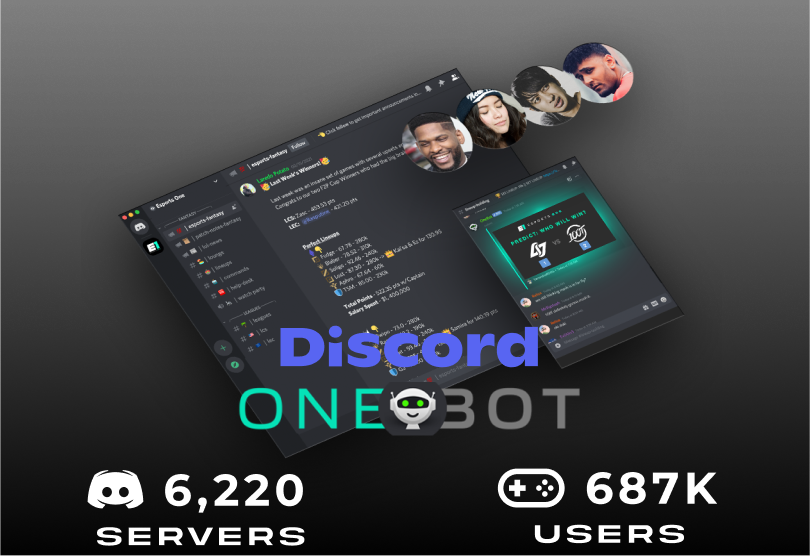
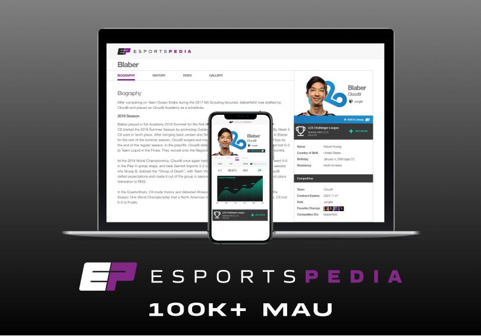
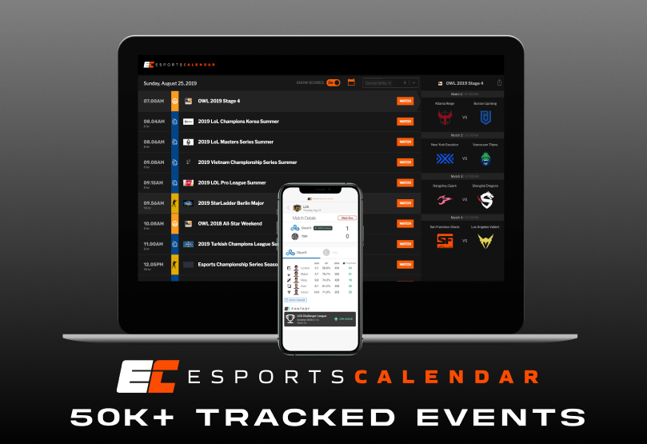

# Our Ecosystem

Esports One stays with the user every step of their esports journey from fantasy to research. We reach them where they are at, whether they are looking for the next tournament to watch on Esportscalendar or going on a deep dive for the richest information about their favorite teams and players on Esportspedia. On top of this, our active community and expert analysts are always discussing various esports and competing in match predictions through our Discord Bot, OneBot, that we developed to drive conversation and elevate fans' viewing experiences.

## Discord OneBot

With more than 300 million users on Discord, we built the first esports bot that brings fantasy to where you hang out. [OneBot](https://top.gg/bot/533024429517570049) allows users to interact with their fantasy contests inside Discord, making it easy for friends or entire communities to play fantasy together. Users can check their  score, lineup points, rank, make predictions about pro matches, and receive notifications about their fantasy contests - while never leaving Discord.&#x20;

Join our [Discord](https://discord.g/e1) to learn more!

## Esportspedia

[Esportspedia](https://esportspedia.com) is a network of Wikipedia-style sites covering a wide range of esports game titles and creators. Our extensive dataset that goes back to 2010 includes up-to-the-minute match details, player history, team information, and more. Esportspedia is maintained by 100’s of community contributors, with every data collection sourced across the internet, including our Esports One stats databases.

## Esportscalendar

Esportscalendar is the all-in-one esports event calendar that tracks all major esports titles, including schedule, rosters, match results, etc. Esportscalendar is fully integrated into OneBot, with users searching for and being notified when their favorite team is about to play or the schedule of matches for the day.

## MetaGallery

_Coming soon._

_The esports creator and fan showroom, making it easy for users to show off their collections._

