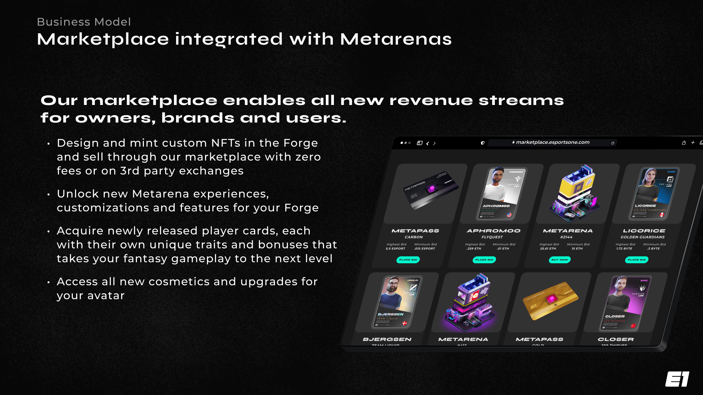

# Marketplace

There is no question that when it comes to marketplaces for NFTs, options are limited and typically don't reward community members for their participation. An ecosystem as large as ours deserves its own tools and resources, especially considering the goal of becoming a decentralized metaverse. The Esports One marketplace will be a gamified system that rewards members for buying/selling and has nominal marketplace fees. A percentage of marketplace fees will go directly to the Community Treasury to fund community initiatives and giveaways.

Our marketplace and auction house are being developed, and will be released in the coming months. You will still be able to trade any Esports One NFTs on other marketplaces, but in reality, why trade somewhere that doesn't reward you or have fees that favor you?

### Technology

Hybrid approach that utilizes the [Wyvern Protocol](https://wyvernprotocol.com/) and would allow users to buy, sell and trade NFTs with our own platform token, stablecoins, and other ERC-20 tokens. This ensures that marketplace isn't reliant on the platform blockchain.

Data will be processed both on the blockchain as well as in local databases, allowing for faster and better resource allocation for indexing, sorting and collection of information.

* Next.js microservice
* PostgreSQL
* gRPC
* [Pinata](https://pinata.cloud)
