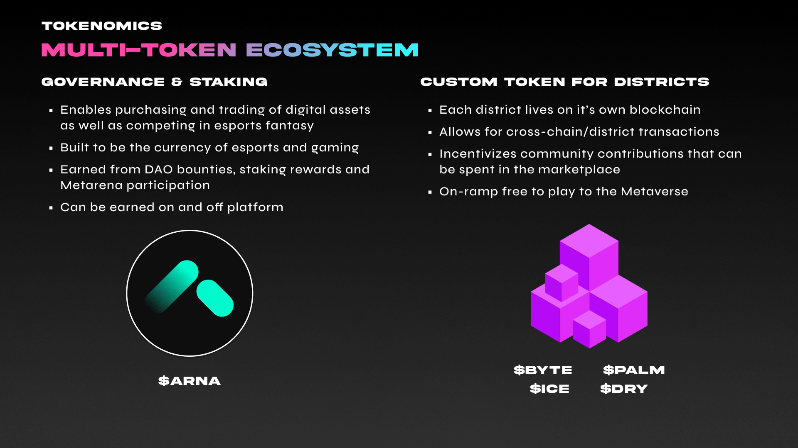

# Primary Token


**Total Supply:** 1,000,000,000

$ARNA is an ERC-20 utility token that serves as the primary utility asset for transactions and represents ownership in Esports One. ****&#x20;


### What is $ARNA?

Our primary token, **ARNA**, is a fungible governance, staking, and access token made for gamers and esports fans. Over the next six years One (1) Billion ARNA tokens will be minted and distributed and will be used to power our entire platform and ecosystem through multiple utilizations. Users can acquire ESPORT tokens via direct purchase, contest rewards, staking incentives, and through ASSET sales in the marketplace.

ESPORT tokens are used to mint and purchase NFT assets, along with staking to gain deeper access to the platform. The tokens revenue is captured via the [Economy](../monetization.md).

### What is $ARNA used for?

The **ARNA** token is the catalyst of the ecosystem and provides a way for players to compete in fantasy contests. Players can assemble a team of digital trading cards representing specific pro-players that get benchmarked against their real-world performance, determining how well your team does. Our vast array of league types makes competing accessible to anyone.

## Stake to Play

Token staking is a consensus mechanism where users are incentivized to lock up their tokens in exchange for rewards ([token staking explained](https://www.youtube.com/watch?v=oiDtX1quIWA)).

To address the issues we see in "Play-to-Earn" blockchain games, our team has created a new way to play, "**Stake-to-Play.**" This method encourages users to stake their **$ARNA** token, which, in addition to yield and other rewards, unlocks access to fantasy leagues and contests based on the amount they have staked.

### Why should I stake $ESPORT?

Through our staking method, you can play how you want, when you want, and never have to worry about losing money or time. When you stake **ESPORT**, you are rewarded with **xESPORT** which provides contest access, account features, and unique experiences based on the amount and duration the tokens are staked. The ultimate value for staking **ESPORT** will derive from access and status, with more features introduced over time to incentivize staking.

The initial rate of **ESPORT** to **xESPORT** is 1:1, but as rewards are added, one **xESPORT** will be worth increasingly more **ESPORT**.&#x20;

### **Arena Access**

Instead of risking tokens to participate in contests, access to Arena's are based on the number of tokens staked to the ecosystem.

| Arena Tier | $ESPORT Staked  |
| ---------- | --------------- |
| **Tier 0** | -               |
| **Tier 1** | 50 **xESPORT**  |
| **Tier 2** | 100 **xESPORT** |
| **Tier 3** | 250 **xESPORT** |

### What are the incentives for staking ESPORT?



* Compete in higher tier Arenas for bigger rewards
* Greater chance of earning card packs with higher rarity
* Exclusive access to unique contests and game types.



* Early access to new features
* Stats & data dashboards&#x20;
* Player and team research tools
* Discord [OneBot](../../about-us/our-ecosystem.md#onebot)



* Early/exclusive access to new releases
* Limited edition NFTs
* Ability to purchase with ESPORT or BYTE



* Promotional events
* Tokens & player cards
* Account bonuses
* Partner & Sponsored NFTs



* Esports tournaments and leagues
* VIP access to gaming bars & clubs
* Discounts to conferences
* Parties
* Festivals



* Limited edition NFTs
* Custom avatar cosmetics
* In-Person Meetups
* Virtual AMAs
* Merchandise Discounts & Giveaways&#x20;



### Governance

* Participate directly in the future of the esports metaverse.
* Accept new partners and brands.
* Voting on platform proposals, token allocations & distributions.
* Determine new game titles supported.

## Additional Use

### Buyback

A specific portion of transaction fees will be used to buy back **$ESPORT** tokens on the open market, which will be transferred to the treasury and staking reward pools.

### LP Pools

**$ESPORT** holders can participate in various token pools and programs by staking their **$ESPORT** tokens. By providing liquidity, participants will earn rewards in yield, exclusive arena access, and premium features.&#x20;

### Governance

We believe in giving our community the power to influence decisions and incentivize active participation. We're doing this through the creation of a DAO. The $ESPORT Token will act as a governance instrument, enabling token owners and verified creators to vote and influence new features and product expansion decisions. The DAO verification board will most importantly approve new partners and certify their token and NFT authenticity.

Anyone that holds $ESPORT will have the ability to participate in the community DAO. Those that actively participate in the DAO will earn rewards & incentives associated with their level of involvement and will have access to future councils and leadership teams with even greater token allocations. Ultimately, participating in the DAO will provide you with the ability to:

* Voting on new game titles to support
* Delegating voting membership
* Approving new investments
* Defining and submitting new proposals
* Onboarding brand partners & providing support
* Defining new platform features and integrations including 3rd party support.
* Much more to come
