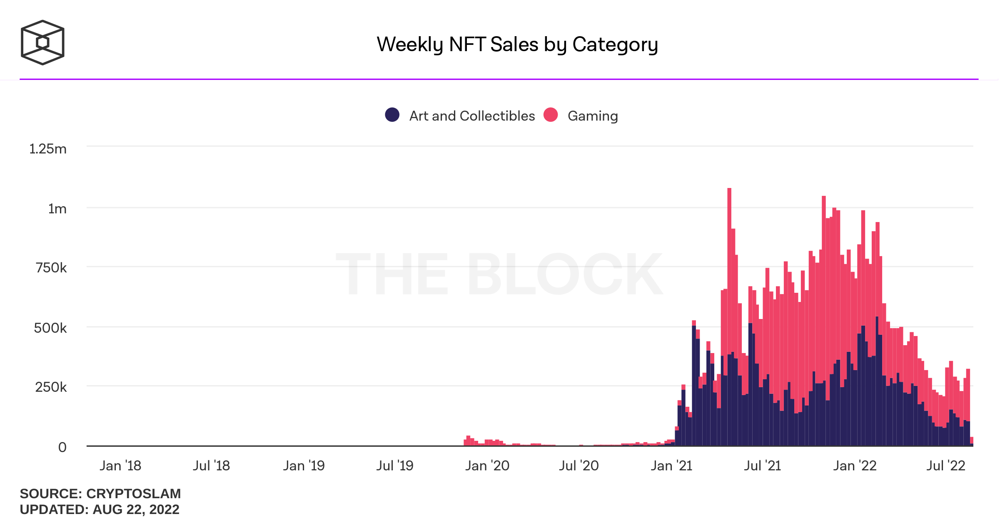
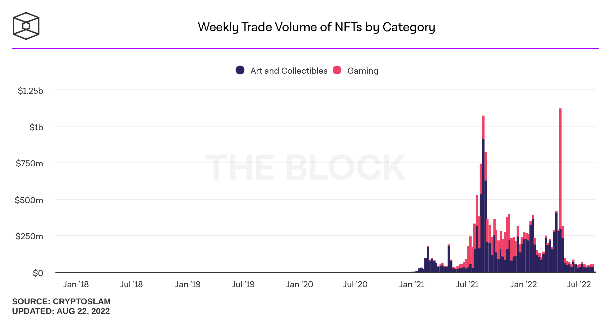

# Market

### **Esports & Gaming**

The gaming market, already valued at $150B, continues to grow with an increasing user base alongside increasing spending. Today there are **3.1 billion people** that play video games worldwide. **Esports is one of the fastest-growing industries,** with the fan base specifically growing year on year.&#x20;

Between 2021-2025, forecasts show a CAGR of 9.32%, resulting in revenues of $223 billion by 2025.

| Year           | Market Rev. | Global Viewership | LoL Worlds |
| -------------- | ----------- | ----------------- | ---------- |
| **2020**       | $970M       | 436M              | 46M        |
| **2021**       | $1.28B      | 474M              | 73M        |
| **2025 (est)** | $2.89B      | 577M              | -          |

### NFTs

 
