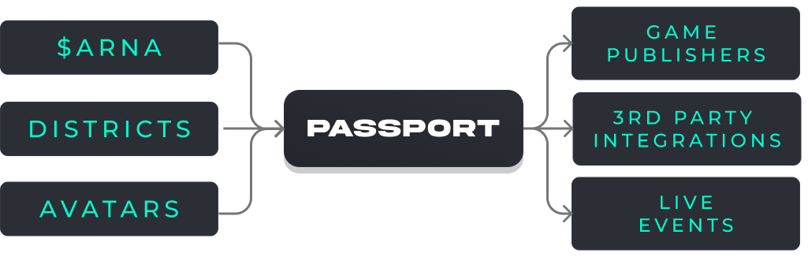

# Avatars

We’re living in the future of the metaverse where everyone has their own digital identity. This future feature release will allow you to create a custom virtual avatar to represent yourself in the esports metaverse. Completely customizable with the ability to transform over time.

### ONEPassport

Our esports and gaming crypto wallet (Codename: ONEPassport) is our solution to decentralization in gaming. Later this year we will begin to roll out the first blockchain enabled wallet that connects to all of your gaming accounts, regardless if they are built on the blockchain or not, and brings it all together in one location. Showcase your skins, cosmetics, achievements, levels and more, both inside the metaverse and out, that you can carry around with you wherever you go built specifically for esports fans and gamers worldwide. 

### **Features** 

* Live event check-ins
* Mobile wallet for taking your collection with you
* Game publisher API integration
* Track contest performance of your cards
* In-game rewards
* Earn XP and progression
