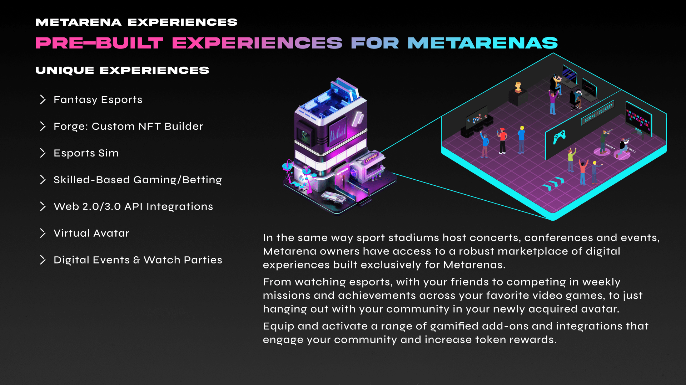

# Experiences

Metarena owners will be able to access a range of gamified feature add-ons called **experiences** - that are activated directly from the dashboard. Experiences are pre-built features made available to Metarena owners. No longer will Metaverses rely solely on UGC (User Generated Content). Instead owners can enable, upgrade and customize the experiences that are available for their communities.

Experiences are features that are created by Esports One and can be utilized by any eligible arena. Owners will be able to enable experiences for their arena, allowing users to access and participate by staking directly in the arena. Experiences at their core are gamified components and tools that are used to engage and entertain your community. They are all optional, and provide rewards such as $ESPORT, $BYTE, and NFTs.&#x20;

### Types of Experiences


[forge.md](forge.md)



[fantasy-esports.md](fantasy-esports.md)



[skill-based.md](skill-based.md)



[esports-sim.md](esports-sim.md)



[virtual-events.md](virtual-events.md)


### **Integrations**

Integrations work similarly to experiences, with the difference being they are gamified reward systems connected to off-platform games created by partnered publishers and web3 projects. Utilizing 3rd-party APIs, integrations will provide a variety of rewards for your community such as exclusive partner NFTs, [POAPs](https://medium.com/poap/what-is-poap-d7e8fdfc207d), and airdrops.
