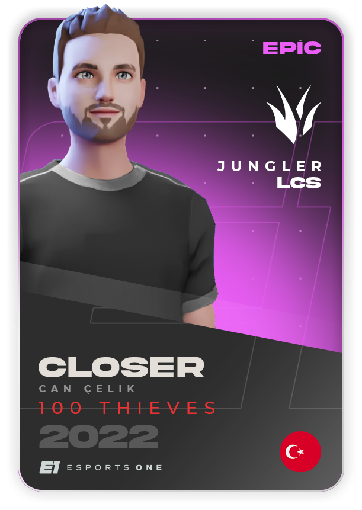
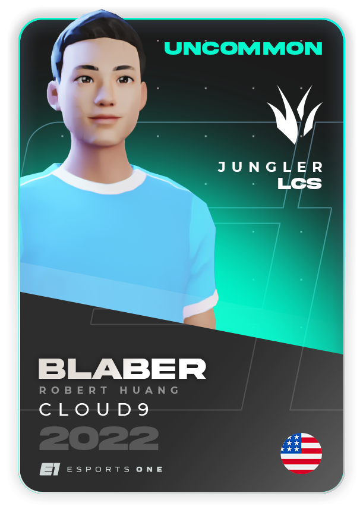
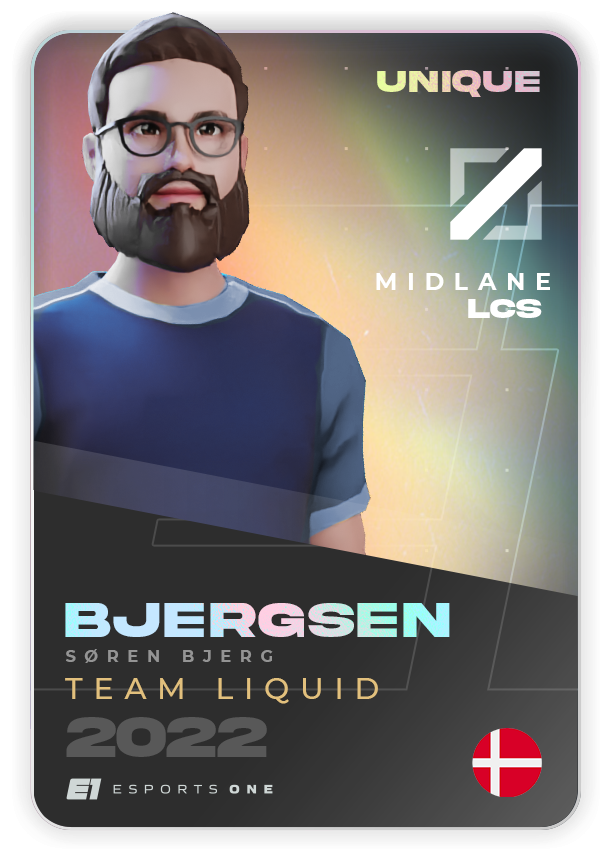

# Fantasy Esports

Similar to fantasy football, soccer, basketball, and baseball, fantasy esports is a stats-based game that makes watching esports more exciting and engaging. As a team manager, you will create a lineup of real-life professional esports players, when your selected players compete in their matches, your fantasy lineup will score points based on each player's performance.\
\
The first available esports title will be the globally popular game, [League of Legends](https://www.leagueoflegends.com/en-us/), where two teams of five real-life professional players compete to be the first team to destroy the opposing team's nexus, or homebase.

#### Future Fantasy Game Titles

The beauty of fantasy esports is the ease of onboarding new game titles, since all that's needed is access to the developers' third-party API and slight adjustments to the ruleset and scoring. This means we can add any popular esports title, as well as exciting new blockchain games, as approved by OneDAO.

## Stake to Play

* **Staking** will grant access to more arenas and fantasy contests across the esports metaverse. Staked Managers are rewarded with $ARNA & $xARNA, in addition to rare cards based on contest performance and passively rewarded with $BYTE.&#x20;
* **Unstaked** will still grant access to a select range of contests; with rewards being distributed in $BYTE.

## How to Play Fantasy

### **Getting Started**

The first step is going through the onboarding experience, this will be where fantasy managers will learn the basics of playing esports fantasy on the metaverse and receive their first collection of card. We will initially launch with support for League of Legends, with more game titles to come soon.

### **Collect Cards**

  

Fantasy lineups are created by selecting the Player Cards you want to use in each contest. This means that the better the cards you collect, the better your lineup will potentially score. Common and uncommon cards can be earned through engaging on the platform or in packs paid for using $BYTE. Rare and higher cards can be bought, traded, and sold on the marketplace using $ARNA.

### **Arena Contests**

Playing fantasy starts by choosing an Arena that has a contest you want to join. Provided you meet the entry criteria, you will be able to enter! Arenas can host a range of contests from each League of Legends region, with ranging scoring types and varying rules - this makes sure contests are always fresh and exciting!

### **Set Lineup**

Once you have entered a contest, you will need to build a lineup based on the requirements specified in that Arena's contest rules. The traditional League of Legends fantasy lineup consists of one player from each role; Top lane, jungler, mid lane, bot lane, and support. The idea is to pick the player cards based on the pro-players you think will perform the best that day/week.

### **Earn Rewards**

After you've submitted your lineup and all corresponding pro-players have finished their matches, your team will receive the points the assigned pro-player earned based on their real-life performance. The higher your team score, the greater your chance of earning rewards.

### Integrity

To create a system that drives competition and rewards fairly, specific contests will have restrictions to the player card rarities that can be used. For example, a user that has only collected common and uncommon cards can choose to compete against only user with similar cards. However, the managers who want to earn larger amounts of $ARNA and rare player cards will have to enter the higher rarity or open contests!

## Collectible Player Cards

Arenas are only half of the esports fantasy experience. The other half belongs to you, the managers. Our fantasy experience puts the power to succeed in your hands. Building the best lineup of player cards not only gives glory, but it also rewards you in $ARNA tokens!&#x20;

Player cards are the foundation for creating your fantasy lineup and entering contests. Each player card is assigned to a real esports professional; when that player competes in their real matches, your fantasy player card scores points. As a manager, it's important to keep collecting, trading, and selling player cards so you can build the best possible lineups - just like a professional team!

### How to Acquire Player Cards?

Common and uncommon cards are obtained by purchasing packs using tokens, either earned passively or won from contests. Staked managers can earn rare player cards by winning contests. All managers will be able to purchase higher rarity cards from 3rd party exchanges, auctions and our marketplace.

### Card Rarities

Cards will have different rarities based on quality, value and bonuses. The higher the rarity, the better the percentage bonus it provides. A rare player card will consistently score than the lower rarity version. It's in the managers' best interest to collect the higher rarities as it will increase the likeliness of winning contests and earning $ARNA.

### Metadata

Each season and card will have unique metadata that determines everything from characteristics to rarity. These are still a work in-progress and subject to change.

Properties

#### **Mutability**

NFT assets are made up of metadata that is either mutable or non-mutable. Mutable assets have metadata capable of evolving or changing depending on the evolution mechanic, while non-mutable asset metadata is locked once minted.

#### **Unique**

Every asset contains a set of properties that make them different. This will typically be the **UUID**.

#### Owners

This shows the number of owners the asset had and whether the current owner is the first owner of the ASSET.

#### **Traits**

Certain types of our NFTs are assigned traits that are non-cosmetic and provide extrinsic motivation and rewards. Traits can be activated once, multiple, or an infinite number of times.&#x20;

**Profit-Sharing**

* Owning an ARENA entitles the user to share profits from future contest buy-ins.
* Partnered NFTs will include a royalty for future transactions of their NFT.

**Open-Source Bounty System**

* Contributors to our open-source projects will receive an exclusive _Developer NFT_
* The _Developer NFT_ levels up based on GitHub commits.
* Higher levels lead to more significant rewards
  * $ESPORT Tokens
  * $BYTES
  * NFT Airdrops
  *   Revenue from projects contributed towards.

      _Ex: Developer contributes towards Valorant Game Expansion and receives a share of Valorant contest revenue_

#### **Attributes**

Our NFTs have cosmetic elements that are either predetermined, randomly assigned, or mutable as the token evolves.

#### **Tier**

Each NFT collection is assigned a rarity tier that determines the quantity that will ever be minted. This ensures our tokens are provably scarce and desirable in the short and long run.

#### Exclusivity

Certain NFT assets may include an exclusivity badge that restricts ownership to only fans of a creator that meet specific criteria, typically set by the token creator. These requirements will either be a first or third party.

**First Party**

* Social token ownership
* NFT assets held
* Account / Creator level

**Third-Party**

* Is the fan subscribed to the creator on Twitch?
* Social media follower status
* Discord activity
* Attended in-person event

Type

After minting an NFT, it can either be added directly to the Marketplace, attached as a fantasy contest reward, linked to a battle pass, or airdropped based on various criteria.

#### **Marketplace**

The Esports One marketplace provides a way for users to buy NFTs rewarded through the fantasy platform. The sale type can either be reserved price or auction. Smart contracts will control the flow of NFT transactions. Additionally, users that hold a certain number of $ESPORT will have exclusive access to NFTs not available to the public.

* Reserved Price: Pre-determined price that can be purchased using either $ESPORT, $ETH, or Creator Tokens
* Auction: Starting price and length of time the auction will be live.

#### **Card Score**

* Each NFT has an independent quality score calculated based on rarity, quantity, and traits. The rarity and quantity will help determine the entry requirements for certain contests.
* Rewards: Attach NFT as a contest reward for winning or competing in a fantasy contest.

_NFT\_SCORE = QUALITY\_SCORE + (ARENA\_TIER \* 1.25)_

#### **Airdrop & Lotteries**

Holders of $ESPORT token and Esports One NFTs will be eligible for daily and weekly airdrops and lotteries. A few things that might be airdropped are additional token allocations, free contest entries, NFT upgrade potions, virtual and physical merchandise, Creator experiences, and many more.

Status

**Minted:** Visible only to the creator and admin team

**Assigned:** Set to marketplace, fantasy or airdrop

**Marketplace:** Requires a reserved or auction price

**Fantasy:** Requires fantasy metadata to be set. Is the NFT unique or can it be resold?

**Airdrop:** What actions will activate the airdrop

**Acquired:** Purchased by a user in the marketplace, won playing fantasy, or received from an airdrop

