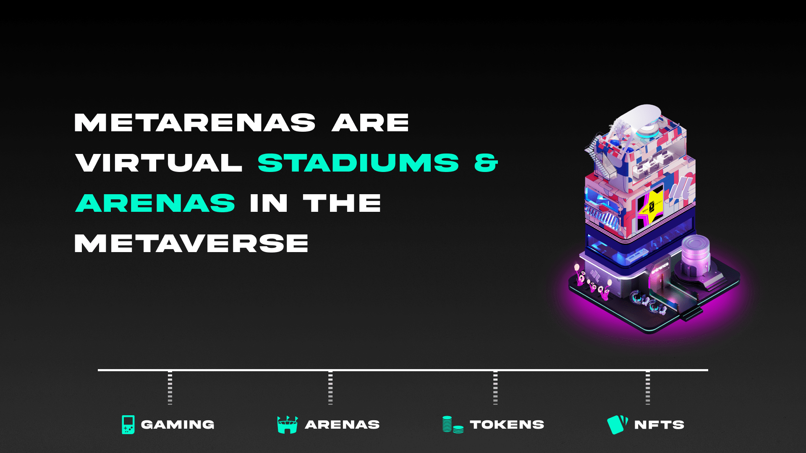

# Metarenas

## Metaverse Made For Gaming & Esports

We're building the digital landscape that connects esports and gaming under one virtual roof. From watching esports, with your fantasy league to competing in weekly missions and achievements across your favorite video games, to just hanging out with your community in your newly acquired avatar.

Arenas are digital NFTs representing virtual land in the esports metaverse and are the foundation for hosting fantasy contests, earning token rewards, and building communities. Every Arena will be entirely unique and residing in its own region of the map called Districts, with the first arenas residing in the Metapunk District and consisting of 1,000 unique arenas, each with varying rarity, traits and utility.

To access the Esports Metaverse, users must hold a Metapass. However, access to Arenas are solely up to the owner and can either be open-access, restricted based on NFT or token ownerships, or based on the number of $ARNA tokens staked.

## Owning an Arena

Overtime your Arena will earn experience (XP) and levels. Every ten (10) levels will unlock a new tier. Tier activation requires $ARNA tokens will enable additional features including:

* Custom Arena Experiences (Fantasy, Viewing Parties, Skill-Based Gaming)
* Design & Mint Custom NFTs
* OneBot: Unique Discord Bot for Your Server
* Airdrops, Lotteries, and Giveaways
* Arena Battles
* Exclusive Marketplace
* DAO: Independent Governance

## Staking

### How Arena Staking Works

All arenas start at Tier 0 and once staked will begin earning a percentage of the $ARNA weekly token allocation. Staked Arenas earn experience will unlock the ability to upgrade the Arena to the next tier by spending $ARNA. Every tier upgrade will unlock the next level of $ARNA allocation (i.e., the Tier 1 allocation) and the best part is that the Arena will still earn $ARNA allocation from the lower tiers.

In addition to arenas earning $ARNA and experience, owners will also passively earn $BYTE and be eligible for random rare Player Card drops and other airdrops. The higher the arena tier, the more contest, game title, cosmetics, and event functionality will become unlocked. These features will be unlockable using $BYTE that are earned from the arena distribution, playing fantasy. and other game experiences.&#x20;

**Tier 0:** Level 1-9

**Tier 1:** Level 10-24

**Tier 2:** Level 25-49

**Tier 3:** Level 50

### Staking Rewards

**Valuable Rewards**\
Owning an Arena provides a passive income of $ARNA, unlocks a rewarding leveling tier system, and enables rare NFT card airdrops.&#x20;

**Experiences**\
****Arenas give you the power to host a range of exciting fantasy contests across a variety of game titles and eventually sports titles.

**Community Building**\
****Build your virtual venue & club to grow and engage with communities, guilds, and brands. Arenas will have a vast range of features and tools in the future to create an experience that is authentic and ever-expanding.&#x20;

## Clubs

Higher tier arenas that meet certain requirements will have the ability to create a club. Participation in a club will require holding xARNA.

Clubs can create a shared asset (card) catalog that can be delegated to club members. Arena owners receive a share from contests using club assets.

### Management Tools

* Name your Club/Add logo
* Look up individual member performance
* Admin Discord Bot&#x20;
* View detailed Club analytics

### Club Leagues&#x20;

Clubs can compete in LEAGUES for even bigger rewards. This is based on the amount of xARNA staked by all Club members.&#x20;

* Monthly Leagues
* Seasonal Leaderboard

_Earn xARNA from staking and scoring on global and arena leaderboards._ \
_Holding xARNA provides governance rights and share of fees from transactions_

### DAO

Clubs will also have the ability to activate a DAO that enables governance mechanics.

## Partnerships

Arenas will be able to add customized branding to both the cosmetic look of the virtual venue and the marketing material for hosted events. &#x20;

While most Arenas will be owned and managed by individuals, certain Arenas owned by creators, teams, brands, and influencers can be verified as a partner. Partnered arenas will have an additional partnered trait and will be limited in total supply. After launch, arenas will have the ability to apply to become a partner through a verification process. This means any arenas can be partnered, even if you acquire from a secondary market.

Partnered arenas will have a slightly aesthetic that allows for custom branding, sponsor integrations, access requirements and additional asset creator tools. Arena owners can build an Arena around their brand, favorite game title, and community.&#x20;

We are constantly building out the partner program and accepting new members to launch their arenas. If you, your company, or someone you would like to nominate for the program, please reach out to us on [Discord](https://discord.gg/e1) or [Twitter](https://twitter.com/esportsone). We will eventually hand over governance of the partner program to OneDAO to ensure it always remains in line with the community values and goals.

### Verification

We will require all partners to verify their identity before making them eligible to mint custom branded assets. Once approved, partners will begin the onboarding process to help ensure mutual success.

It's important to note that a partner's account must adhere to strict security requirements that protect the integrity of the ecosystem, including:&#x20;

* Verifying and authenticating their identity
* Securely configuring their account and connecting their wallet
* Designing guidelines for NFT assets&#x20;
* Determining what the ideal traits and rewards should be&#x20;
* Integrating OneBot on their Discord server, allowing their community to share their NFT collection and fantasy performance and earn bytes

### Brand/Sponsor Marketplace

We are also creating a marketplace for brands where owners can accept sponsorships for their arenas. This ensures we are constantly creating more value for owners, while bringing real-world brands into the metaverse.
