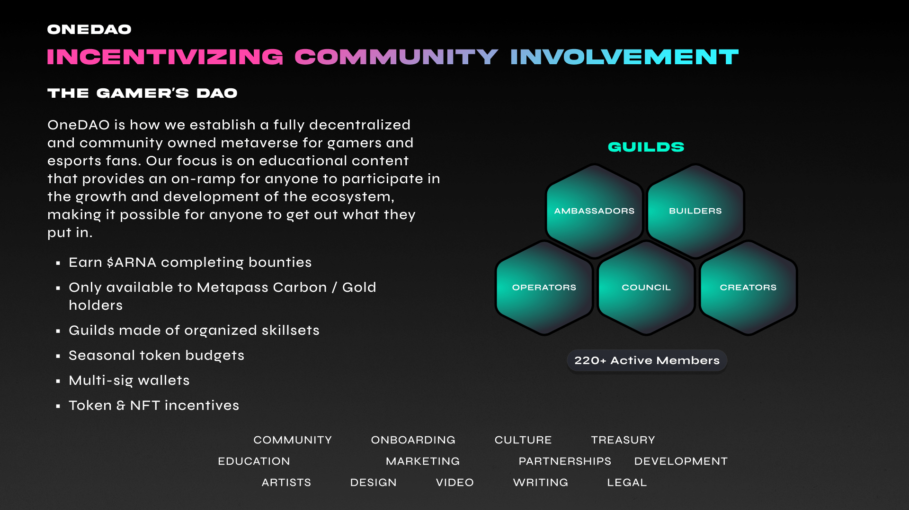
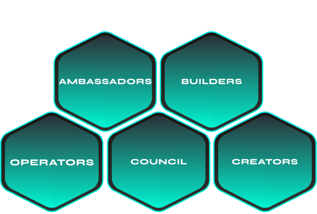

# OneDAO

Don’t wait to be told what to do. _Jump in and write, build, create._ When something you do aligns with the mission of the DAO it will find ways to reward your participation.

Contributors are community members that have created something of value for OneDAO through their grit and effort, including:

* Author and pass a proposal that will be a landmark decision for OneDAO
* Help others in the community above and beyond what is asked of you
* Hop in on projects and start taking on tasks/responsibilities
* Attend weekly guild meetings
* Establish processes and procedures that elevate participation from other members

## Structure

[Metapass](metapass.md) holders can actively participate in Guilds with governance being limited to token and metarena owners.

### Council

A mix of staff, community, and advisors who oversee all guild proposals, legal support and multi-sig management.

* Guild Leads
* Legal
* Multi-sig

### Guild Leaders

Specialized leaders manage teams of contributors and oversee the day-to-day operations of a guild. Guild leaders are voted in based on the track record of contribution for executing projects over sustained periods. Guild leaders are empowered to set key priorities, allocate budgets for bounties or rewards, and ultimately are responsible for that guild's success. Guild leads are allocated a salary each season  that ensures accountability and rewards innovation.

### **Member**

Members that power each guild – specialized token holders that join based on skills and interest. Contributors are compensated based on their contribution level via social graphs and guild and program budgets.

## Guilds

Guilds are workgroups that organize specialist skill sets into a single location. Guilds are the foundation of OneDAO and are made up of individual collectives. Creating a guild gives DAO members a way to group together and offers the community direct access to a source of skilled labor. Anyone that holds a metapass can participate in a guild.

### Ambassadors

**Primary Goal:** Increasing the number of token holders

The ambassadors guild plays a significant role in the development and growth of the ecosystem. This includes referring new users, creating social media and marketing content, advocating at conferences and events, and creating educational content that better serves new and existing users of web3.

| Program          | Details                                                                                                                                       |
| ---------------- | --------------------------------------------------------------------------------------------------------------------------------------------- |
| **Education**    | Create education content, guides and resources for the entire web3 community, new and old.                                                    |
| **Marketing**    | Establish ongoing Marketing activations that promote the value of the ecosystem and bring new users to the platform.                          |
| **Partnerships** | Acquisition and continued support of new partners and their communities                                                                       |
| **Research**     | Understand what the future of web3 looks like through engaging with other projects, talking to the community, attending conferences and more. |
| **Social Media** | Maintain our social media presence across all major platforms and define our voice accordingly.                                               |

### Builders

**Goal:** Empowering esports fans and fantasy managers with tools for navigating the esports metaverse

| Program         | Details                                                      |
| --------------- | ------------------------------------------------------------ |
| **Analytics**   | Provide a clear understanding of ecosystem performance.      |
| **Data**        | Data science                                                 |
| **Development** | Open-source development & bounties                           |
| **Engineering** | Full-stack engineering, system architecture and design.      |
| **Product**     | Product management. Documentation and and project oversight. |

### Creators

| Program        | Details                                                                                                                        |
| -------------- | ------------------------------------------------------------------------------------------------------------------------------ |
| **Art**        | Creating the masterpieces that live inside the metaverse and out.                                                              |
| **Audio**      | Podcast, music and recordings                                                                                                  |
| **Design**     | UI/UX                                                                                                                          |
| **Newsletter** | Recurring newsletters that's shared via email and the blog and provides an internal and external summary of OneDAO activities. |
| **Video**      | 3D, motion effects, promo content.                                                                                             |
| **Writing**    | Creating written content for the blog and other guild initiatives.                                                             |

### Operators

**Goal:** Watch over daily activities of the DAO, so everyone is aligned with the general mission and vision. Facilitate core operations, people, budgets and targets, project delivery and strategy. Facilitate and support all other aspects of the DAO to function smoothly and rapidly

| Program        | Details                                                               |
| -------------- | --------------------------------------------------------------------- |
| **Culture**    | Maintaining what makes us, us.                                        |
| **Events**     | Hosting and managing online events and contests.                      |
| **Moderation** | Moderating and managing discord servers, forums, and platform content |
| **Onboarding** | Onboarding and support of new players and arena owners.               |

### Earning Tokens

#### **Tips**

These come from other OneDAO contributors for valuable or desirable contributions in the moment. (For work done, well-spoken comments, answering member questions, or whatever the tipper values) - Tips are sent to a Collab.Land wallet connected to your username and can either be used for tipping others or can be withdrawn to a personal wallet.

#### Bounties

Bounties can be posted by Arena owners and Team Leads and will be posted in the #bounty-board channel. Bounties can come in the form of one-time or recurring job requests. Some bounties can only be claimed if you have the correct role tag. After claiming, it’s your responsibility to coordinate with the bounty poster. Payment is made upon delivery of requested action or material and can come in the form of a tip (Collab.Land), or through a guild or project during their scheduled pay round (direct to ETH wallet).

#### **Compensation**

Retroactive remuneration for part or full-time contribution to a Guild. Rewards are determined by each Guild during the seasonal funding process. Roles are typically elected positions and offer a stable inflow of $ARNA for the duration of that role. To be considered for a role you must be active within that Guild or project and nominate yourself during an election cycle. Internships are available for some roles and compensation is shared between the role holder and the apprentice.

#### **Grants**

These are awarded to projects deemed useful to the growth of OneDAO or the community at large. You can earn some of this grant money by contributing to a Guild or project, either in a role or by claiming bounties. Do you have an amazing idea for a project? You can build a team within OneDAO, form a proposal, and apply for a grant! Project proposals must be posted to the OneDAO forum for seven days, and accepted proposals must be submitted to Grants Committee for final consideration.
