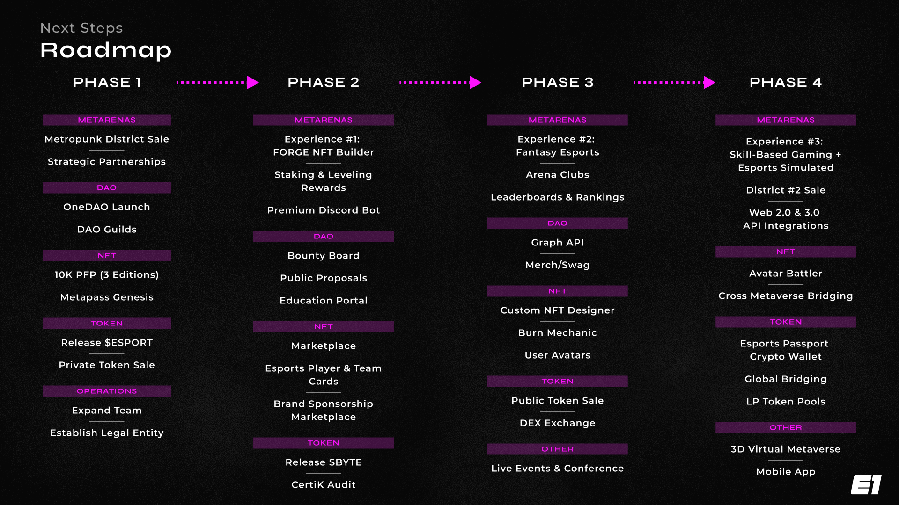

# Roadmap

<figure><figcaption></figcaption></figure>

## Supporting New Game Titles 

Expanding into new game titles is relatively formulaic and comes down to long-term sustainability. We are currently adding Valorant and Counterstrike, followed by Rocket League, and are in talks with several Web3 Esports Game Titles.&#x20;

Following the process of approving a new game title to expand into, we begin the process of data collection.

### How do we obtain game data? 

Suppose the publisher or another 3rd party provides an API. In that case, we will investigate the stats provided and their quality as this can shorten our time to market as we get a head start on publishing stats ahead of having our computer vision solution for the game ready. We also use API data to validate our computer vision (CV) models to ensure quality and accuracy.

Our CV models are developed using Python, and then once we meet a specific accuracy rate, we transfer the trained models to our production CV system, OneVision. We then validate our ML models using a mix of API gathered data (if available) and annotated data.&#x20;

Because of how we use GraphQL to insulate consumers of data from our DB schema, we take an iterative approach to building the stats interface for a game by continuously expanding it with new stats values as they become available.

### Stats Tiers

Stats are categorized by tier based on the following:&#x20;

* Current utilization and comprehension by the general public and potential users
* Analytical value across multiple aspects of the game
* Ability to provide in-depth analysis and secondary supporting stats
* The overall difficulty of retrieving and calculating the statistic



Required to support the game title



Essential to have but could function without and would negatively affect the user experience



Is nice to have but will have little impact on the user experience.



Will be stored if it requires little development overhead.


